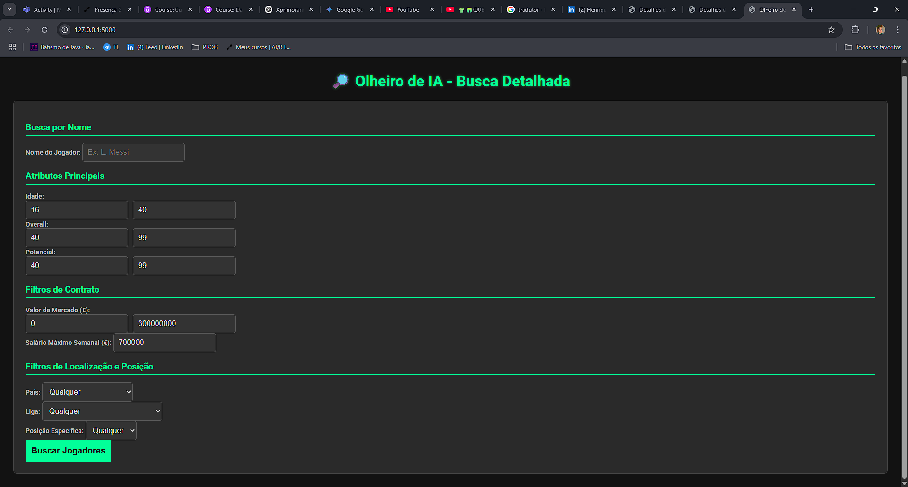
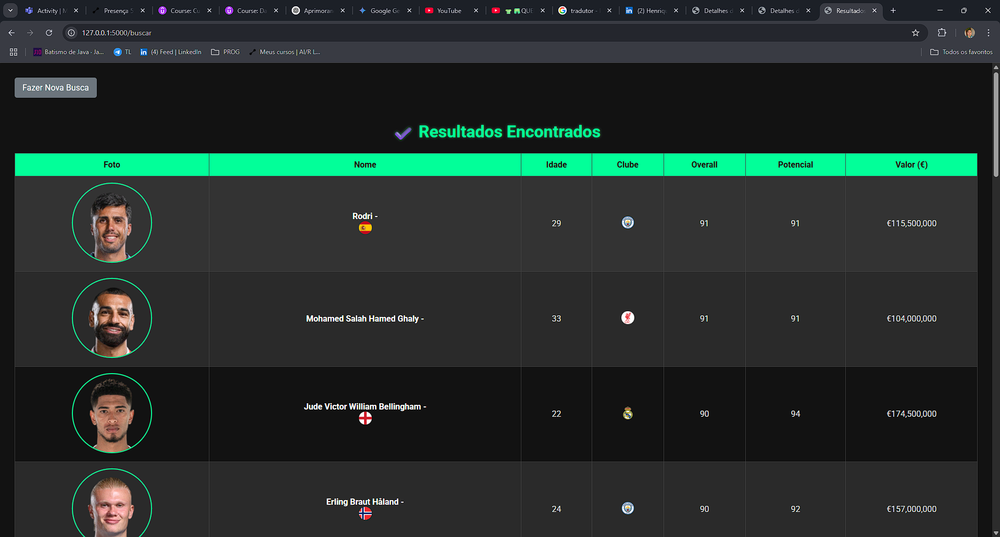
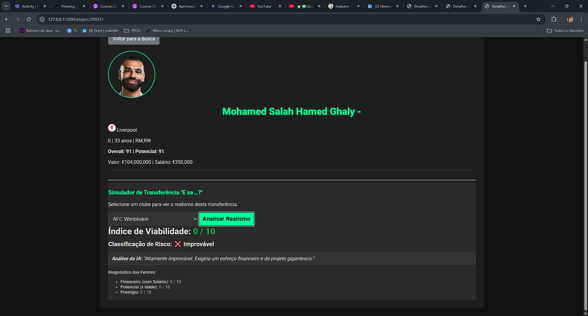

# 🤖 Olheiro de IA - Um Centro de Scouting Profissional para EA FC

**Autor:** [Seu Nome Completo]
**Projeto para a disciplina:** [Nome da Disciplina] - [Nome da sua Faculdade]

---

## 1. Visão Geral do Projeto

O "Olheiro de IA" é uma aplicação web completa, desenvolvida em Python com o framework Flask, que serve como uma plataforma avançada de scouting de jogadores para o Modo Carreira do jogo EA Sports FC. A ferramenta vai além de simples filtros, utilizando um sistema de Inteligência Artificial com múltiplas camadas para permitir que os usuários encontrem talentos de forma precisa e analisem a viabilidade de transferências através de um motor de realismo sofisticado.

O projeto foi concebido para resolver um desafio central dos jogadores do Modo Carreira: a dificuldade em identificar jogadores com alto potencial e bom custo-benefício em meio a uma base de dados com mais de 18.000 atletas.

---

## 2. Screenshots da Interface

**Página de Busca "Modo Sofifa":**




**Página de Resultados com Ordenação e Paginação:**

**

**Página de Detalhes com o Simulador de Realismo da IA:**




---


## 3. Arquitetura e Funcionalidades

A aplicação foi construída com uma arquitetura robusta para garantir performance e uma experiência de usuário fluida.

### ✨ Funcionalidades Principais:

* **Busca Multi-Critério:** Um formulário de busca avançada permite a filtragem por mais de 10 parâmetros simultâneos, incluindo intervalos de idade, overall, potencial, valor e salário, além de seleções específicas de nome, país, liga e posição.
* **Resultados Dinâmicos:** A interface de resultados é totalmente interativa, com paginação para navegar por grandes volumes de dados e cabeçalhos de tabela clicáveis que reordenam os jogadores instantaneamente.
* **Perfil Detalhado do Jogador:** Cada jogador possui uma página de perfil completa, exibindo todos os seus atributos, informações contratuais e biográficas em um layout limpo e profissional.
* **Módulo de Análise Preditiva (IA):** O coração do projeto. Na página de detalhes, um "Simulador de Transferência" permite que o usuário selecione qualquer clube do jogo e receba uma análise instantânea sobre a viabilidade daquela contratação, com uma nota de 0 a 10 e um diagnóstico detalhado.

---

## 🧠 O Motor de Inteligência Artificial: Um Mergulho Profundo

A IA deste projeto não é um único algoritmo, mas sim um **sistema integrado** que opera em três camadas para emular o processo de um scout profissional.

### Camada 1: Engenharia de Conhecimento (Data Wrangling)
A base de qualquer sistema inteligente é a qualidade dos seus dados. A primeira função da IA é transformar o dataset bruto e inconsistente (`.csv`) em uma base de conhecimento estruturada.
* **Interpretação Semântica:** O sistema interpreta e converte valores textuais como "€1.5M" e "€500K" para seus equivalentes numéricos.
* **Extração de Padrões:** Utiliza lógica para analisar atributos como "85+2" e extrair apenas o valor base (`85`), descartando o ruído.
* **Criação de Features:** Gera informações novas que não existem no dataset original, como o cálculo da `idade` a partir da data de nascimento.
* **Tratamento de Dados Faltantes:** Lida de forma robusta com milhares de células vazias (`NaN`), garantindo a estabilidade da aplicação e a integridade dos dados exibidos.

### Camada 2: Sistema Especialista (Busca Avançada)
A interface de busca atua como um **Sistema Especialista**, um tipo clássico de IA que emula a capacidade de tomada de decisão de um especialista humano.
* **Base de Regras:** O formulário de busca, com seus múltiplos filtros, constitui a base de regras que o "especialista" (o usuário) define.
* **Motor de Inferência:** A lógica de filtragem do Pandas no backend atua como o motor que aplica essas regras complexas sobre a base de conhecimento, inferindo quais jogadores satisfazem os critérios.

### Camada 3: Modelo Heurístico (Motor de Realismo v2.3)
Esta é a camada mais avançada, onde a IA faz um **julgamento qualitativo**. O "Simulador de Transferências" utiliza um modelo heurístico sofisticado para dar uma nota de realismo, ponderando 5 fatores-chave:
1.  **Prestígio (Peso 55%):** Compara o nível do jogador com o do clube, aplicando uma penalidade **não-linear** para diferenças grandes e um bônus para "saltos na carreira", tornando a avaliação mais realista.
2.  **Financeiro (Peso 35%):** Avalia o valor de mercado e, crucialmente, o **salário do jogador em relação à média salarial da liga** do clube alvo, adicionando uma camada de realismo financeiro.
3.  **Potencial vs. Idade (Peso 10%):** Modela a lógica de que o potencial em jogadores jovens é muito mais valioso, aplicando um **multiplicador decrescente com a idade**.
4.  **Rivalidade:** Consulta uma base de conhecimento de rivalidades históricas para aplicar uma penalidade massiva em transferências "proibidas".
5.  **Necessidade do Elenco:** Simula uma análise tática, verificando se o clube já possui jogadores superiores na mesma posição.

Ao final, a IA fornece não apenas uma nota, mas um **diagnóstico detalhado** e um **comentário de especialista**, classificando a transferência como "Viável", "Arriscada" ou "Improvável".

---

## 🛠️ Tech Stack

* **Backend:** Python, Flask
* **Manipulação de Dados:** Pandas, NumPy
* **Frontend:** HTML5, CSS3, JavaScript (com Fetch API para interatividade)
* **Versionamento:** Git, GitHub

---

## 🚀 Como Executar o Projeto

1.  **Clone o Repositório:**
    ```bash
    git clone [https://github.com/rhbebeto/Trabalho_IA.git](https://github.com/rhbebeto/Trabalho_IA.git)
    ```

2.  **Navegue até a Pasta:**
    ```bash
    cd Olheiro_IA_FIFA
    ```

3.  **Crie um Ambiente Virtual (Recomendado):**
    ```bash
    python -m venv venv
    source venv/bin/activate  # No Windows: venv\Scripts\activate
    ```

4.  **Instale as Dependências:**
    ```bash
    pip install -r requirements.txt
    ```

5.  **Execute a Aplicação:**
    ```bash
    python app.py
    ```

6.  Abra seu navegador e acesse: `http://127.0.0.1:5000`
